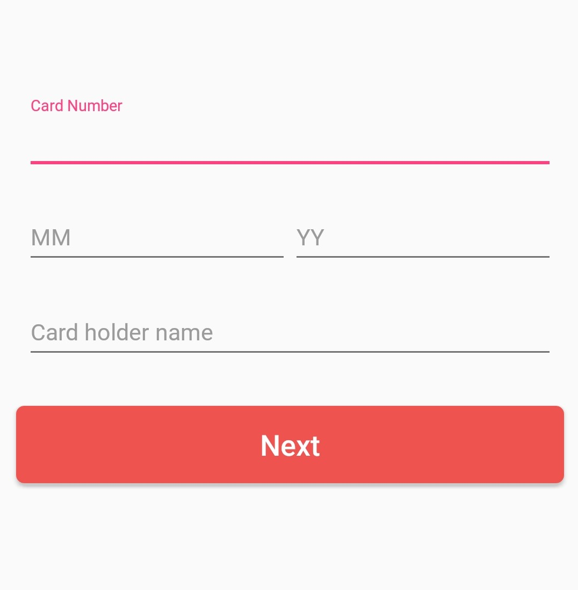

# Android

---

## Get Started

### Permissions

Open your app's AndroidManifest.xml file and add the following permission.

``` http
<uses-permission android:name="android.permission.INTERNET" />
```

---

### Configuration

First, save the following values in the app

``` http
MERCHANT_ID="{}"
CLIENT_ID="{Client id will return after you sign up}"
ORDER_ID="{}"
RETURN_URL="Return url from response handler"
```

### Url

| CONSTANT           | STRING                            |
| ------------------ |--------------------------------|
| OGO_BASE_URL       |`https://test-ipg.ogo.exchange` |
| OGO_REGISTER_CARD  |`/registercard-json`            |

``` url
  String URL = OGO_BASE_URL + OGO_REGISTER_CARD;
```

## Native Android Implementation

Implement a view to enter card details.



---

### Import dependencies

Volley is an HTTP library that makes networking for Android apps easier and most importantly, faster.
The easiest way to add Volley to your project is to add the following dependency to your app's build.gradle file:

``` gradle
dependencies {
    ...
    compile 'com.android.volley:volley:1.1.1'
}
```

### JSON Object

Create a new JSONObject and add the following values

``` java
 JSONObject addNewCardJson = new JSONObject();
            addNewCardJson.put("cardHolderName", {YOUR CARD HOLDER NAME});
            addNewCardJson.put("cardNumber", {YOUR CARD NUMBER});
            addNewCardJson.put("expiryMonth", {YOUR CARD EXPIRY MONTH});
            addNewCardJson.put("expiryYear", {YOUR CARD EXPIRY YEAR});
            addNewCardJson.put("merchantId", MERCHANT_ID);
            addNewCardJson.put("customerId", CLIENT_ID);
            addNewCardJson.put("orderId", ORDER_ID);
            addNewCardJson.put("returnUrl", RETURN_URL);
```

### Send card details to the server

Using volley library send card details to the server.

``` java
RequestQueue queue = Volley.newRequestQueue(getApplicationContext());

JsonObjectRequest jsonObjectRequest = new JsonObjectRequest(Request.Method.POST, url, addCardRequest,
    new Response.Listener < JSONObject > () {

        @Override
        public void onResponse(JSONObject response) {
            //Check the response and load it on webview
        }
    }, new Response.ErrorListener() {

        @Override
        public void onErrorResponse(VolleyError error) {

        }
    })
    {

        @Override
        public Map < String, String > getHeaders() throws AuthFailureError {

            HashMap < String, String > header = new HashMap < String, String > ();
            header.put(Config.CONTENT_TYPE_HEADER, "application/json");

            return header;
        }
    };

    jsonObjectRequest.setRetryPolicy(new DefaultRetryPolicy(10000, DefaultRetryPolicy.DEFAULT_MAX_RETRIES, DefaultRetryPolicy.DEFAULT_BACKOFF_MULT));

    queue.add(jsonObjectRequest);

```

### Response

If the request is successful it will return the following response

``` json
{
  "success": true,
  "message": "3DSecure Page",
  "result": "<!DOCTYPE HTML PUBLIC..."
}
```

### Check the response and load the HTML page

``` java
@Override
public void onResponse(JSONObject response) {
    //Check the response
    //If the request is success
    //Load html page on a webview
    if (response.getString("success").equals("true")) {

        webView.loadData(response.getString("result"), "text/html; " + "charset=utf-8", "UTF-8");

        //waiting for receive redirect url
        webView.setWebViewClient(new WebViewClient() {

            @Override
            public boolean shouldOverrideUrlLoading(WebView view, String url) {

                if (url.contains("add-success=true")) {
                finish(); //if url returns "true" close the view and back to main
                } else {
                    Toast.makeText(getApplicationContext(), getString(R.string.new_add_card_fail_message), Toast.LENGTH_LONG).show();
                    return false;
                }
            });
        }
    }
}
```

<!-- 		

## Using android library

*Step 1.* 
Add the JitPack repository to your build file.
Add it in your root build.gradle at the end of repositories:

``` java 
allprojects {
	repositories {
		...
		maven { url 'https://jitpack.io' }
	}
}
```

*Step 2.*
 Add the dependency

``` java 
dependencies {
	    implementation 'com.github.charithvithanage:OgoCard:0.1.4'
}
```

Add the following code to the activity

*.MainActivity*

```java
public class MainActivity extends AppCompatActivity {

    private static final String TAG ="OgoCardRegister" ;
    OgoCardView cardView;

    @Override
    protected void onCreate(@Nullable Bundle savedInstanceState) {
        super.onCreate(savedInstanceState);
        setContentView(R.layout.activity_main);

        cardView=findViewById(R.id.cardView);
        cardView.setMerchantId(MERCHANT_ID);
        cardView.setCustomerId(CLIENT_ID);
        cardView.setReturnUrl(RETURN_URL);
        cardView.setOrderId(ORDER_ID);
        cardView.setOgoBaseUrl(OGO_BASE_URL);
        cardView.setOgoRegisterCard(OGO_REGISTER_CARD);

        cardView.setListner(new WebViewListner() {
            @Override
            public void onSuccessResponse(String url) {
                Log.d(TAG,url);
            }

            @Override
            public void onErrorResponse(String error) {
                Log.d(TAG," ERROR "+error);

            }
        });

    }
}
```

*.activity_main*

```xml
<?xml version="1.0" encoding="utf-8"?>
<LinearLayout
        xmlns:android="http://schemas.android.com/apk/res/android"
        xmlns:tools="http://schemas.android.com/tools"
        android:layout_width="match_parent"
        android:layout_height="match_parent"
        tools:context=".MainActivity">

    <com.info.charith.ogocardview.OgoCardView
            android:id="@+id/cardView"
            android:layout_width="match_parent"
            android:layout_height="match_parent">
    </com.info.charith.ogocardview.OgoCardView>

</LinearLayout>
```
-->
