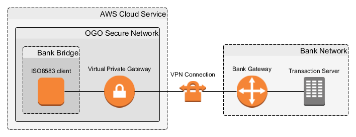
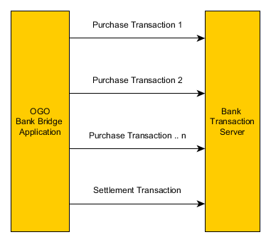
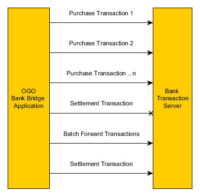

##########################
Onboarding a Bank with OGO
##########################

The OGO platform behaves similar to a virtual POS terminal when communicating
with the bank. All credit and debit card transactions are sent as **ISO8583**
transactions to the bank via a VPN.

Types and formats of transactions to be expected by the bank are detailed in
:ref:`iso-messages`

Onboarding check list for banks
===============================

* VPN connectivity
* 3DSecure
* ISO8583 transactions support

VPN Requirements
================

A site to site VPN to connect with OGO will have to be setup by the bank. The
bank's public facing IP (gateway IP) and other related information will need to
be communicated. 

The VPN will be first be created by OGO on AWS and all necessary VPN
configurations will then be provided to the bank to setup their end.

3DSecure
========

In OGO, 3DSecure is used to validate a card when it first gets registered in an
application. The bank needs to provide a mechanism to initiate the 3DSecure
process. This is easily done via MiGS or MPGS.

Upon initial registration of the card, the user will have to pass 3DSecure if
their card is enrolled in 3DSecure. Upon successful validation of 3DSecure, the
card details will be stored in OGO and a token representing the card details
will be issued. Susbsequent transactions will be processed using this token. For
more information on 3DSecure, please refer to :ref:`3DSecure`

.. _iso-messages:

ISO8583 Messages and Flow
=========================

The following section outlines sample ISO8583 messages and their typical flow.
Only requests sent to the bank are shown below. The responses may vary from bank
to bank.

Since OGO supports tokenization adhering to PCI-DSS, only the card number and
the expiry will are stored securely. Information such as Track 2, PIN block, CVV
etc will not be stored and will not be available when performing transactions.

All transactions sent to the bank will therefore behave like Manual Key Entry
transactions.

Flow
----

On a typical business day, a merchant would send multiple purchase transactions
to the bank via their POS Terminal. At the end of the day, a settlement
transaction will be sent with the sum of transactions. 

This same process is followed by OGO. If the settlement fails, a series of batch
forward transactions matching the purchase transactions will be sent and a
settlement will be attempted again.

Purchase
--------

**Raw Hex**

.. code-block:: none

    60000000000200703c058000c0000416444444444444444400000000000001000000000111123608162012001000170037353030313030313230353937303031313030313030310006313031202020

**Break Down**

.. code-block:: none

    HEADER:     6000000000
    MTI:        0200
    BITMAP:     703c058000c00004
    Field 2:    164444444444444444
    Field 3:    000000
    Field 4:    000000010000
    Field 11:   000001
    Field 12:   113658
    Field 13:   0816
    Field 14:   2012
    Field 22:   0010
    Field 24:   0017
    Field 25:   00
    Field 41:   3735303031303031
    Field 42:   323035393730303131303031303031
    Field 62:   0006313031202020

Void
----

**Raw Hex**

.. code-block:: none

    60000000000200703c058008c0000416444444444444444402400000000001000000000111455108162012001000170030303030313031202020202031313232333334343132333132333435363435363132330006313031202020

**Break Down**

.. code-block:: none

    HEADER:     6000000000
    MTI:        0200
    BITMAP:     703c058008c00004
    Field 2:    164444444444444444
    Field 3:    024000
    Field 4:    000000010000
    Field 11:   000001
    Field 12:   114551
    Field 13:   0816
    Field 14:   2012
    Field 22:   0010
    Field 24:   0017
    Field 25:   00
    Field 37:   303030303130312020202020
    Field 41:   3131323233333434
    Field 42:   313233313233343536343536313233
    Field 62:   0006313031202020

Batch Forward
-------------

**Raw Hex**

.. code-block:: none

    60000000000320703c05800ec0000016444444444444444400000000000001000000000113220108162012001000170031323334353620202020202039383736353430303131323233333434313233313233343536343536313233

**Break Down**

.. code-block:: none

    HEADER:     6000000000
    MTI:        0320
    BITMAP:     703c05800ec00000
    Field 2:    164444444444444444
    Field 3:    000000
    Field 4:    000000010000
    Field 11:   000001
    Field 12:   132201
    Field 13:   0816
    Field 14:   2012
    Field 22:   0010
    Field 24:   0017
    Field 25:   00
    Field 37:   313233343536202020202020
    Field 38:   393837363534
    Field 39:   3030
    Field 41:   3131323233333434
    Field 42:   313233313233343536343536313233

Settlement
----------

**Raw Hex**

.. code-block:: none

    600000000005002038010000c0001292000000000113194208210017313132323333343431323331323334353634353631323300063030373839310120303132303030303032333435363738303030303030303030303030303030303030303030303030303030303030303030303030303030303030303030303030303030303030303030303030303030303030303030303030303030

**Break Down**

.. code-block:: none

    HEADER: 6000000000
    MTI: 0500
    BITMAP: 2038010000c00012
    Field 3: 920000
    Field 11: 000001
    Field 12: 131942
    Field 13: 0821
    Field 24: 0017
    Field 41: 3131323233333434
    Field 42: 313233313233343536343536313233
    Field 60: 0006303037383931
    Field 63: 0120303132303030303032333435363738303030303030303030303030303030303030303030303030303030303030303030303030303030303030303030303030303030303030303030303030303030303030303030303030303030

